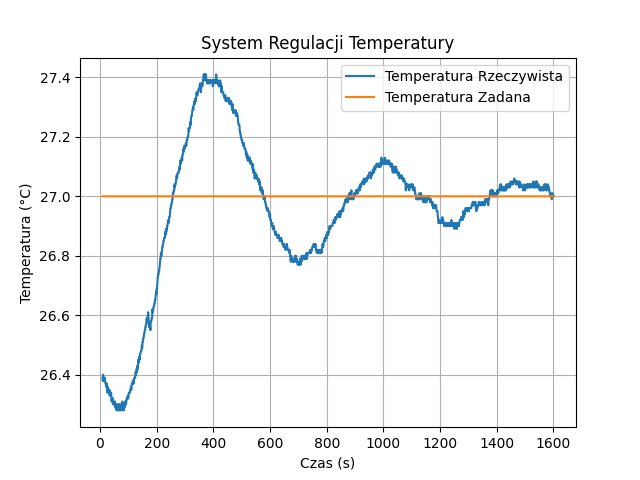

# Mikroprocesorowy Regulator Temperatury PID (STM32)

**Przedmiot:** Systemy Mikroprocesorowe

**Cel:** Zaprojektowanie i implementacja układu sterowania temperaturą z wykorzystaniem algorytmu PID, wizualizacji danych i komunikacji szeregowej.

## 🎥 Prezentacja wideo

[Link do filmu na YouTube](https://www.youtube.com/watch?v=wEF-WTK1dMs)

## 📋 Spis treści

- [Opis projektu](#opis-projektu)
- [Funkcjonalności](#funkcjonalności)
- [Wykorzystane komponenty](#wykorzystane-komponenty)
- [Konfiguracja sprzętowa (Pinout)](#konfiguracja-sprzętowa-pinout)
- [Algorytm sterowania (PID)](#algorytm-sterowania-pid)
- [Instrukcja obsługi](#instrukcja-obsługi)
- [Wizualizacja i Telemetria](#wizualizacja-i-telemetria)
- [Wyniki i Charakterystyka](#wyniki-i-charakterystyka)

## 📝 Opis projektu

Projekt realizuje układ zamkniętej pętli regulacji temperatury przy użyciu mikrokontrolera z rodziny STM32. System odczytuje temperaturę otoczenia za pomocą czujnika BMP280, a następnie steruje elementem grzejnym (rezystorem) w celu osiągnięcia i utrzymania zadanej wartości (Set Point).

### Wymagania projektu

Projekt spełnia wymagania minimalne oraz rozszerzone:

- ✅ Realizacja algorytmu PID w czasie rzeczywistym
- ✅ Dwukierunkowa komunikacja UART (odbieranie komend i wysyłanie telemetrii)
- ✅ Obsługa lokalnego interfejsu: Enkoder obrotowy oraz wyświetlacz LCD 2x16

## 🚀 Funkcjonalności

### 🔍 Pomiar

- Odczyt temperatury z czujnika BMP280 (Interfejs I2C)

### 🎛️ Sterowanie

- Algorytm PID sterujący czasem włączenia grzałki (Time Proportional Control) w cyklu 1-sekundowym

### 👆 Interfejs użytkownika (HMI)

- Wyświetlanie temperatury zadanej i aktualnej na LCD
- Zmiana temperatury zadanej za pomocą enkodera obrotowego

### 📡 Komunikacja (UART)

- Wysyłanie danych w formacie tekstowym do rysowania wykresów (np. w Telemetry Viewer)
- Zdalna korekta temperatury zadanej za pomocą komend `+` / `-`

## 🛠 Wykorzystane komponenty

Zgodnie z założeniami projektowymi:

| Komponent              | Model/Opis                                         | Funkcja                        |
| ---------------------- | -------------------------------------------------- | ------------------------------ |
| **Mikrokontroler**     | STM32 (Zestaw Nucleo)                              | Główny jednostka sterująca     |
| **Czujnik**            | BMP280 (Temperatura/Ciśnienie)                     | Pomiar temperatury             |
| **Wyświetlacz**        | LCD 2x16 ze sterownikiem I2C (HD44780 + PCF8574)   | Interfejs użytkownika          |
| **Sterowanie**         | Enkoder inkrementalny                              | Ustawianie temperatury zadanej |
| **Element wykonawczy** | Grzałka (rezystor mocy) sterowana przez tranzystor | Element grzejny                |
| **Sygnalizacja**       | Dioda LED                                          | Sygnalizacja grzania           |

## 🔌 Konfiguracja sprzętowa (Pinout)

| Peryferium           | Pin / Port    | Funkcja                        |
| -------------------- | ------------- | ------------------------------ |
| **Grzałka (Heater)** | PD7           | Wyjście sterujące (PWM/On-Off) |
| **BMP280**           | I2C1          | Komunikacja z czujnikiem       |
| **LCD 2x16**         | I2C4          | Wyświetlacz                    |
| **Enkoder**          | TIM1          | Ustawianie temperatury zadanej |
| **UART**             | USART3        | Komunikacja z PC (115200 baud) |
| **LED Status**       | LD1_Pin (PB0) | Sygnalizacja włączenia grzałki |

## 🎛 Algorytm sterowania (PID)

W projekcie zaimplementowano dyskretny regulator PID wg wzoru:

```
u(t) = Kp·e(t) + Ki·∫e(t)dt + Kd·de(t)/dt
```

### Parametry strojenia (nastawy)

W kodzie zdefiniowano strukturę `PID_Controller` z następującymi wartościami:

| Parametr | Wartość | Opis                       |
| -------- | ------- | -------------------------- |
| **Kp**   | 400.0   | Wzmocnienie proporcjonalne |
| **Ki**   | 10.0    | Wzmocnienie całkujące      |
| **Kd**   | 50.0    | Wzmocnienie różniczkujące  |

### Ograniczenia wyjścia (Clamp)

Sygnał sterujący jest ograniczony do zakresu 0 - 1000. Wartość ta jest mapowana bezpośrednio na czas włączenia grzałki w milisekundach (w pętli 1-sekundowej).

```c
// Fragment implementacji sterowania czasem (Time Proportional Control)
int32_t heating_time = (int32_t)pid_output; // 0 do 1000 ms
int32_t cooling_time = 1000 - heating_time;
```

## 📖 Instrukcja obsługi

### 🚀 Uruchomienie

Po podłączenia zasilania, na ekranie LCD pojawi się komunikat powitalny, a następnie aktualna temperatura i temperatura zadana (T_zad).

### 🎛️ Zmiana temperatury (Lokalnie)

Obracaj enkoderem, aby zwiększyć lub zmniejszyć zadaną temperaturę.

### 📡 Zmiana temperatury (Zdalnie)

1. Otwórz terminal portu szeregowego
2. Ustawienia: 115200 baud, 8N1
3. Wyślij znak `+` aby zwiększyć offset temperatury lub `-` aby zmniejszyć

### 💡 Sygnalizacja

Dioda LED oraz pin PD7 są w stanie wysokim, gdy regulator dostarcza ciepło do układu.

## 📊 Wizualizacja i Telemetria

Mikrokontroler wysyła dane na port UART w formacie tekstowym, co ułatwia ich parsowanie przez programy typu Telemetry Viewer lub Serial Plotter.

### Przykład danych

```
26.50 27.00
26.62 27.00
26.80 27.00
```

Pozwala to na wykreślenie charakterystyki skokowej i zbadanie uchybu regulacji w czasie rzeczywistym.

## 📈 Wyniki i Charakterystyka

### Charakterystyka skokowa regulatora PID



Powyższy wykres przedstawia charakterystykę skokową systemu regulacji temperatury z zadaną temperaturą 27.0°C. Widoczne jest działanie regulatora PID, który skutecznie doprowadza temperaturę do wartości zadanej z minimalnym uchybem regulacji. Po ustabilizowaniu wykresu błąd wynosił około 3-4%.

## 🧮 Analityczny dobór nastaw (Metoda Zieglera-Nicholsa)

W celu wyznaczenia optymalnych nastaw regulatora, zamiast metody prób i błędów, zastosowano **II Metodę Zieglera-Nicholsa** (metodę oscylacji krytycznych). Pozwala ona na wyliczenie nastaw na podstawie zachowania układu w stanie niestabilnym (oscylującym).

### 1. Wyznaczenie parametrów krytycznych

Na podstawie przeprowadzonego eksperymentu (widocznego na wykresie charakterystyki), doprowadzono układ do granicy stabilności, uzyskując stałe oscylacje temperatury. Z wykresu odczytano dwa kluczowe parametry:

| Parametr                             | Opis                                                                              | Wartość |
| ------------------------------------ | --------------------------------------------------------------------------------- | ------- |
| **Ku** (Wzmocnienie krytyczne)       | Wartość wzmocnienia członu proporcjonalnego (Kp), przy którym wystąpiły oscylacje | ≈ 650   |
| **Tu** (Okres oscylacji krytycznych) | Czas pomiędzy dwoma kolejnymi szczytami temperatury                               | 600s    |

**Obliczenie okresu oscylacji:**

- Szczyt 1: t₁ ≈ 400s
- Szczyt 2: t₂ ≈ 1000s
- **Tu = t₂ - t₁ = 1000s - 400s = 600s**

### 2. Obliczenia nastaw PID

Dla klasycznego regulatora PID, metoda Zieglera-Nicholsa definiuje następujące zależności dla struktury równoległej:

```
Kp = 0.6 · Ku
Ti = 0.5 · Tu
Td = 0.125 · Tu
```

#### Wzmocnienie Proporcjonalne (Kp)

```
Kp = 0.6 · 650 = 390 ≈ 400
```

#### Czas zdwojenia (Ti) i parametr Ki

```
Ti = 0.5 · 600s = 300s
```

W implementacji cyfrowej (dla czasu próbkowania Ts = 1s):

```
Ki = (Kp · Ts) / Ti = (400 · 1) / 300 ≈ 1.33
```

> **Uwaga:** W projekcie finalnie dobrano Ki = 10 ze względu na dużą bezwładność termiczną i potrzebę szybszej likwidacji uchybu statycznego.

#### Czas wyprzedzenia (Td) i parametr Kd

```
Td = 0.125 · 600s = 75s
```

W implementacji cyfrowej:

```
Kd = (Kp · Td) / Ts = (400 · 75) / 1 = 30000
```

> **Uwaga:** W praktyce człon różniczkujący dla obiektów cieplnych generuje duże szumy, dlatego eksperymentalnie zredukowano Kd do wartości 50, aby wygładzić sterowanie.

### 📝 Wnioski z obliczeń

Obliczenia metodą Zieglera-Nicholsa dały punkt startowy dla nastaw (**Kp ≈ 400**). Ze względu na specyfikę obiektu (rezystor o dużej inercji), nastawy członu całkującego (Ki) oraz różniczkującego (Kd) zostały skorygowane, aby zapewnić mniejsze przeregulowanie i szybszy czas ustalania, co jest typową praktyką inżynierską (tzw. _fine-tuning_).
